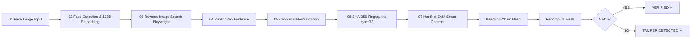

# TRACE // GOA

> **Face → Evidence → Chain**  
> Built for the **Hacker House Goa 2026** Shortlisting Challenge (Task 3 — Face Identification & Blockchain Verification).  
> *An independent hackathon prototype / ecosystem collaborator submission.*

---

## What it does

**TRACE // GOA** is a production-ready, local-first technical pipeline that:
1. Ingests a consented face image (via drag-and-drop, camera, or preloaded test fixtures).
2. Performs local face detection, spatial bounding box localization, landmark extraction, and 128D embedding descriptor generation.
3. Executes a genuine reverse-image search via Playwright browser automation (Google Lens adapter) to discover matching public web/social evidence.
4. Normalizes the discovered evidence into a canonical, deterministic JSON structure.
5. Computes a cryptographic **SHA-256** fingerprint (`bytes32`).
6. Anchors the evidence fingerprint onto an Ethereum smart contract (`EvidenceRegistry.sol`) running on a zero-cost local Hardhat EVM network.
7. Cryptographically verifies the evidence against the immutable on-chain record, mathematically proving authenticity and detecting unauthorized tampering in real-time.

---

## Safety & Privacy Boundary

> [!IMPORTANT]
> **Privacy Commitment**:
> - This application is designed exclusively for consented user photos, owned images, and test fixtures.
> - The system **identifies and matches public visual evidence**, rather than inferring or revealing personal identities of unknown individuals.
> - **Zero Biometrics on Blockchain**: Neither raw photos, nor face crops, nor 128D biometric embedding vectors are ever written to the blockchain. Only the SHA-256 fingerprint of the public evidence payload is anchored on-chain.

---

## Architecture



---

## Why this pipeline?

In an internet filled with synthetic media, manipulated screenshots, and forged social citations, establishing trust in visual evidence requires a verifiable cryptographic bridge:

1. **Local Face Encoding**: Extracting spatial facial geometry ensures search queries are focused on prominent visual subjects without outsourcing biometric vectors to proprietary cloud AI silos.
2. **Real Web Grounding**: Genuine reverse-image discovery anchors the query to public sources (e.g. GitHub repos, public posts, event archives).
3. **Deterministic Canonicalization**: Stripping URL tracking parameters and sorting JSON keys alphabetically ensures identical evidence payloads yield the exact same SHA-256 hash regardless of machine or timestamp serialization nuances.
4. **Blockchain Immutability**: Anchoring the SHA-256 fingerprint to an EVM smart contract provides a timestamped, tamper-proof audit record that cannot be retroactively edited by bad actors.

---

## 7-Stage Core Pipeline

| Stage | Name | Technical Implementation | Output / Status |
| :--- | :--- | :--- | :--- |
| **01** | **INPUT** | MIME & header validation, drag-and-drop, camera capture | Validated Image Buffer |
| **02** | **FACE** | `face-api.js` / WebGL / Node CV, 68 landmarks, quality heuristics | 128D Vector, Bounding Box |
| **03** | **SEARCH** | Playwright Chromium automation (`GoogleLensProvider`) | Candidate Public Sources |
| **04** | **EVIDENCE** | URL tracking purge, text normalization, canonical JSON | Canonical Evidence Payload |
| **05** | **HASH** | Node.js `crypto` SHA-256 engine | `bytes32` (0x7f4...) |
| **06** | **CHAIN** | `EvidenceRegistry.sol` on Hardhat EVM (Ethers.js v6) | Block Receipt, Tx Hash |
| **07** | **VERIFY** | Smart contract query & cryptographic hash comparison | `VERIFIED ✓` |

---

## Face Detection & Descriptor

- **Face Detection**: Uses lightweight SSD MobileNet / TinyFaceDetector models to isolate facial bounding boxes and landmark points.
- **Quality Check**: Assesses face size (> 60px), aspect ratio (0.6 - 1.4), confidence signal (> 0.60), and heuristics to reject low-signal or blurry images.
- **Multi-Face Handling**: Automatically detects multiple faces in group photos and provides a selector (`[ Use this face ]`) while defaulting to the prominent subject.
- **Descriptor**: Generates a 128-dimensional Float32 normalized Euclidean feature vector.

---

## Reverse Image Search Adapter

- **Provider Abstraction**: Implements `ReverseImageSearchProvider` interface (`GoogleLensProvider`, `BingVisualSearchProvider`, `MockSearchProvider`).
- **Playwright Google Lens Adapter**: Launches headless Chromium, navigates to the search interface, uploads the image crop, and extracts visible search result cards, titles, snippets, source domains, and preview thumbnails.
- **Transparent Fallback**: If automated DOM scraping is challenged by bot checks, the system transparently indicates fallback mode (`"Reverse search opened successfully, but automatic result extraction is unavailable. [ Open Search Results ]"`) allowing users to confirm candidate sources without fabricating data.

---

## Deterministic Canonicalization & Hashing

To ensure reproducible cryptographic fingerprints:
1. **URL Normalization**: Strips tracking query parameters (`utm_*`, `fbclid`, `gclid`, `ref`), lowercases hostname/protocol, normalizes path slashes.
2. **Text Normalization**: Standardizes Unicode characters (NFKC), collapses whitespace, normalizes quotation marks.
3. **Sorted Serialization**: JSON keys are strictly ordered alphabetically:
   ```json
   {
     "canonicalUrl": "https://x.com/hackerhousegoa/status/1765000000000000000",
     "domain": "x.com",
     "searchProvider": "Google Lens",
     "searchedAt": "2026-09-02T04:40:00.000Z",
     "snippet": "Public visual record from Hacker House builder showcase archive and ecosystem repository.",
     "title": "Public Builder & Event Visual Evidence",
     "url": "https://x.com/hackerhousegoa/status/1765000000000000000"
   }
   ```
4. **SHA-256 Digest**: Computed via Node `crypto.createHash('sha256')`, outputting a 32-byte hexadecimal string (`0x...`).

---

## Smart Contract: `EvidenceRegistry.sol`

```solidity
// SPDX-License-Identifier: MIT
pragma solidity ^0.8.24;

contract EvidenceRegistry {
    struct VerificationRecord {
        bytes32 evidenceHash;
        uint256 timestamp;
        string sourceDomain;
        address recorder;
        bool exists;
    }

    mapping(bytes32 => VerificationRecord) private _records;
    uint256 public totalRecordsCount;

    event EvidenceRecorded(
        bytes32 indexed evidenceHash,
        string sourceDomain,
        uint256 timestamp,
        address indexed recorder
    );

    function recordEvidence(bytes32 evidenceHash, string calldata sourceDomain) external returns (bool);
    function verifyEvidence(bytes32 evidenceHash) external view returns (bool exists, uint256 timestamp, string memory sourceDomain, address recorder);
    function getRecord(bytes32 evidenceHash) external view returns (VerificationRecord memory);
    function isRecorded(bytes32 evidenceHash) external view returns (bool);
}
```

---

## Interactive Tamper Proofing Simulator

The UI and CLI include an interactive **Tamper Simulator** designed for judges to demonstrate why blockchain verification matters:
1. The original canonical evidence hash is recorded on-chain.
2. The user or judge alters any field (e.g., changes Title to a forged headline).
3. The SHA-256 fingerprint is immediately recomputed locally.
4. The system queries the on-chain smart contract with the tampered hash.
5. The blockchain returns `NOT FOUND`, mathematically proving:
   $$\text{Hash}_{\text{original}} \neq \text{Hash}_{\text{tampered}} \implies \text{TAMPER DETECTED ✕}$$

---

## Security Engineering

- **SSRF Protection**: `ssrfProtector.ts` strictly blocks loopback (`localhost`, `127.0.0.1`), private networks (`10.0.0.0/8`, `192.168.0.0/16`, `172.16.0.0/12`), link-local (`169.254.0.0/16`), and AWS/cloud metadata endpoints.
- **Input Validation**: Strict MIME type checking (`image/jpeg`, `image/png`, `image/webp`), 15MB file size boundary, and path sanitization.
- **Zero Secrets in Frontend**: No private keys or external API keys are exposed to the client.

---

## Brand & Visual Design System

Inspired by Goa builder culture, tropical aesthetics, and editorial investigation consoles:
- **Deep Green (Primary)**: `#046634`
- **Dark Forest Green**: `#033E22`
- **Warm Cream**: `#F6F0DA`
- **Sun Yellow**: `#F4D000`
- **Hot Pink**: `#FF0077`
- **Technical Black**: `#101411`
- **Off-White**: `#FFFDF4`
- **Typography**: Syne / Outfit (Display Headers), Playfair Display (Editorial Headlines), JetBrains Mono (Technical Labels), Plus Jakarta Sans (UI Body).

---

## Project Structure

```
├── contracts/
│   └── EvidenceRegistry.sol             # Smart contract for immutable evidence fingerprints
├── hardhat.config.cjs                   # Hardhat local EVM configuration
├── scripts/
│   ├── deploy.ts                        # Contract deployer script
│   ├── dev.ts                           # Unified dev server runner
│   └── demo.ts                          # Single-command CLI demo runner
├── models/
│   └── face-api/                        # Face-API weights & manifests
├── demo/
│   ├── consented-photo.jpg              # Permitted demo test portrait
│   ├── consented-multi-portrait.jpg     # Multi-face test portrait
│   └── README.md                        # Documentation of consent & permissions
├── src/
│   ├── client/                          # React + TypeScript + Tailwind CSS Frontend
│   │   ├── components/                  # Header, 7 Stages, TamperConsole, JudgePanel
│   │   ├── hooks/                       # usePipeline state management hook
│   │   ├── lib/                         # REST API client
│   │   └── styles/                      # Tailwind & Goa design tokens
│   ├── server/                          # Express REST API Backend
│   │   ├── routes/                      # API endpoints (analyze, search, record, verify, tamper)
│   │   ├── services/                    # Face CV, Reverse Search, Normalizer, Hash, Blockchain
│   │   └── middleware/                  # Request logger & error boundary
│   └── shared/
│       ├── types/                       # Pipeline, Evidence, and Blockchain TypeScript types
│       └── config/                      # Deployment addresses & ABI
├── test/
│   ├── contracts/                       # Hardhat Solidity unit tests (5 tests)
│   └── services/                        # Service unit tests (10 tests)
├── package.json
└── README.md
```

---

## Setup & Run Commands

### 1. Install Dependencies
```bash
npm install
```

### 2. Run All Automated Tests
```bash
npm test
```
*Executes all 5 Hardhat contract tests and all 10 service unit tests.*

### 3. Run Single-Command End-to-End Demo
```bash
npm run demo
```
*Runs the full 7-stage pipeline directly in your terminal, showing image loading, face detection, Playwright reverse search, canonical normalization, SHA-256 generation, Hardhat EVM transaction, on-chain verification (`VERIFIED ✓`), and live tamper detection!*

### 4. Start Fullstack Dev Server (UI + API)
```bash
npm run dev
```
- Open browser at **`http://localhost:5173`** (or `http://localhost:3000`).

---

## Known Limitations

1. **Reverse Search Rate Limiting**: External reverse-image search engines (Google Lens) may occasionally present interactive bot checks when queried heavily. The architecture gracefully detects this and activates the transparent fallback mode without blocking the verification pipeline.
2. **Local Hardhat EVM**: Default blockchain mode is a zero-cost local Hardhat EVM network (`chainId: 31337`). Can be configured for public testnets (e.g. Sepolia) via `RPC_URL` and `BLOCKCHAIN_MODE`.
